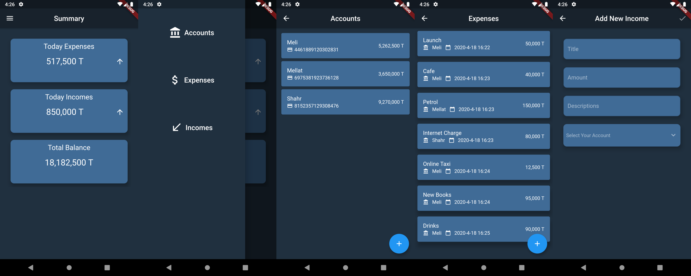

[](https://www.gnu.org/licenses/gpl-3.0)
# meAccounting Personal Accounting App
meAccounting is a Personal Accounting app Written in Flutter that Simply Helps you to submit and track your expenses and incomes.

<strong style="color:red">Currently, The App is Unstable and Highly under Development. So Feel Free to Contribute. Your PRs Gonna make me Happy :)</strong>

I know App's UI may be bad! that's because I'm not front-end guy! so if you can make it beautiful, It'll be great!_

# Run in Debugging Mode
To run in debugging mode, first you need to [install flutter SDK](https://flutter.dev/docs/get-started/install).
1. Clone The Project:
```shell
$ git clone https://github.com/meh666ran/meAccounting.git && cd meAccounting/
```

2. Run `pub get` To get needed dependencies:
```shell
$ flutter pub get
```

3. Run the application while a device connected:
```shell
$ flutter devices # to check if any device exists
$ flutter run
```

# Current Release
Current Released Version is v0.8.0-beta and You can Access To Apk files from [this link](https://github.com/meh666ran/meAccounting/releases/tag/0.8.0-beta).

also you can find all releases' files [on releases page.](https://github.com/meh666ran/meAccounting/releases)

# Contribute
Contributes are always welcome!

to Contribute:
1. Fork The Project.
2. Create a new branch with a suitable name according to what you're changing.
3. Send a pull request.

# License
All Codes Written by me in this project are licensed under [GNU General Public License Version 3](https://www.gnu.org/licenses/gpl-3.0.en.html).

The GNU General Public License is a free, copyleft license for software and other kinds of works.

You can read all Terms and Conditions in [LICENSE file](./LICENSE).

### TODOs for Version 1:
- [x] add Incomes
- [x] remove expenses and income items when dismissed
- [x] add bank account dropdown selector to add expense screen
- [x] add edit expense screen
- [x] add edit income screen
- [x] rename home_screen.dart and dao.dart files
- [x] allow to submit just when all streams have data in add expense and add account screen and edit screens
- [x] make accounts and expenses screen to be updated whenever there's a new object
- [x] show real incomes in summary screen instead of mock data
- [x] Create Some Helper Methods to make UI code cleaner
- [x] Split Numbers by 3 Characters
- [ ] Write Unit Tests
- [x] add up and down arrow to show summary blocks compared to yesterday 
- [ ] add debts
- [ ] add different currencies
- [ ] shopping list
- [ ] add persian language
