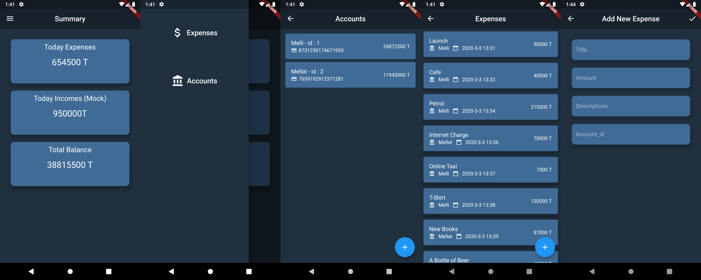

# meAccounting Personal Accounting App
meAccounting is a Personal Accounting app Written in Flutter that Simply Helps you to submit and track your expenses and incomes.

``` diff
- Currently, The App is Unstable and Highly under Development. So Feel Free to Contribute. Your PRs Gonna make me Happy :)
```

_I know App's UI may be bad! that's because I'm not front-end guy! so if you can make it beautiful, It'll be great!_

There are some screenshot from App's UI above:


if you are looking for apk files, [you can find them here.](https://github.com/meh666ran/meAccounting/releases)

### TODOs:
- [x] add Incomes
- [ ] remove expenses and income items when dismissed
- [ ] add bank account dropdown selector to add expense screen
- [ ] add edit expense screen
- [ ] rename home_screen.dart and dao.dart files
- [ ] allow to submit just when all streams have data in add expense and add account screen and edit screens
- [ ] make accounts and expenses screen to be updated whenever there's a new object
- [ ] make UI code cleaner
- [ ] show real incomes in summary screen instead of mock data
- [ ] Create Some Helper Methods to make code cleaner
- [ ] Split Numbers by 3 Characters
- [ ] Write Unit Tests
- [ ] add up and down arrow to show summary blocks compared to yesterday 
- [ ] add debts
- [ ] add different currencies
- [ ] shopping list
- [ ] add persian language
